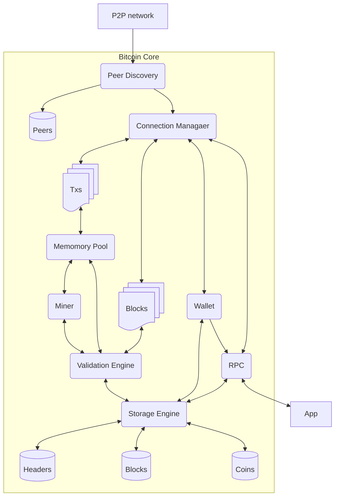

# 3 Bitcoin Core
1. System overview


2. Initial Block Download, IBD
    1. Connect to Peers: bitcoind启动后通过内置的DNS种子发现网络上其他正在运行的比特币节点的IP地址, 并与其建立连接
    ```log
    Loading addresses from DNS seed seed.bitcoin.wiz.biz.
    New outbound-full-relay v1 peer connected: version: 70016, blocks=915590, peer=0
    ```
    2. Pre-synchronizing blockheaders: 下载并验证所有的block header, 每个header包含:
       1. 前一个block的hash
       2. proof-of-work相关数据
       3. 时间戳
       4. 该block所有交易的加密摘要
    ```log
    Pre-synchronizing blockheaders, height: 654000 (~71.70%) 
    Synchronizing blockheaders, height: 250345 (~28.19%)
    ```
    3. Download and validate full blocks: 下载并验证完整区块, 验证过程包含:
        1. 验证proof-of-work
        2. 验证每一笔交易
        3. 更新本地的UTXO set, 防止double spending
    ```log
    UpdateTip: new best=00000000839a8e6886ab5951d76f411475428afc90947ee320161bbf18eb6048 height=1 version=0x00000001 log2_work=33.000022 tx=2 date='2009-01-09T02:54:25Z' progress=0.000000 cache=0.3MiB(1txo)
    UpdateTip: new best=00000000000000000004e2df9c6a2141c56d63ca263e0c620bbfcfce454313f1 height=511844 version=0x20000000 log2_work=88.262394 tx=302630536 date='2018-03-03T18:52:39Z' progress=0.243607 cache=87.1MiB(659835txo)
    ```
    查看验证过程
    ```bash
    $ bitcoin-cli -getinfo
    Chain: main
    Blocks: 523832
    Headers: 915662
    Verification progress: ▒▒▒▒▒▒░░░░░░░░░░░░░░░ 25.5797%
    Difficulty: 4143878474754.188

    Network: in 0, out 9, total 9
    Version: 290100
    Time offset (s): 0
    Proxies: n/a
    Min tx relay fee rate (BTC/kvB): 0.00000100

    Warnings: (none)
    ```
    4. Fully Validating Node正常运行: 将监听网络广播的新交易和新区块, 独立验证新数据, 并将验证通过的数据转发给相连的其他节点

# 4 密钥和地址
## 4.1 Overview
1. 比特币的所有权是通过**数字密钥、比特币地址和数字签名**建立起来的
    1. 数字密钥: 由用户创建，并且存储在一个叫作钱包的文件或者简单的数据库中。分为私钥和公钥成对组成
    2. 数字签名: 只有有效的密钥才能产生有效的数字签名
    3. 比特币地址: 由一个公钥生成并对应于这个公钥
2. 单向加密函数: 很容易在一个方向上计算, 但无法在相反的方向上倒推, 如素数分解和椭圆曲线乘法。比特币使用椭圆曲线乘法作为其密码学的基础
3. 私钥和公钥: 私钥$k$是随机选择的一个数字, 基于私钥$k$可以使用椭圆曲线乘法生成公钥$K$, 基于公钥$K$可以使用单向加密散列函数生成比特币地址$A$
4. 数字签名: 数字签名只能由私钥拥有者生成, 但任何人都可以访问其公钥和数字签名以验证签名的真伪
5. 比特币私钥: 从1到n-1之间的任意数字, $n=1.158*10^{77}$, 略小于$2^{256}$
```bash
# 生成密钥并显示公钥
bitcoin-cli getnewaddress
# 打开钱包并提取getnewaddress生成的对应的私钥
bitcoin-cli dumpprivkey $pubkey
```
6. 椭圆曲线密码学: 比特币使用的是一个特定的椭圆曲线和一组数学常数，它是由美国国家标准与技术研究所(NIST)制定的标准**secp256k1**定义的

## 4.2 比特币地址
1. 比特币地址由公钥经过SHA256和RIPEMD160哈希算法得到一个长度为160位的数字 $$A=RIPEMD160(SHA256(K))$$
2. 比特币地址通常是经过Base58Check编码的
   1. Base58编码由不包含0、1、O、I4个字符(避免混淆)的大小写字母和数字组成
   2. 为了将数据转成Base58Check格式, 先添加版本字节前缀(如比特币地址编码前缀是0、私钥编码前缀是128), 然后计算哈希并取前四个字节作为校验和$$checksum=SHA256(SHA256(prefix+data))$$
3. 私钥的格式: 原始格式、十六进制、WIF(Base58Check编码)、压缩后的WIF
4. 公钥的格式
   1. 椭圆曲线上的一个点, 由坐标值(x, y)组成
   2. 压缩公钥格式: 只存储x坐标, 通过解椭圆曲线方程得到y的值
